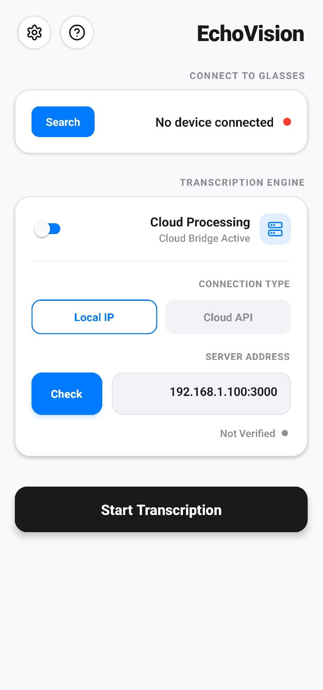
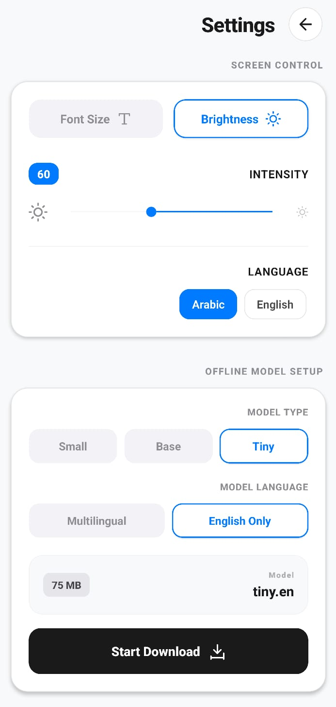
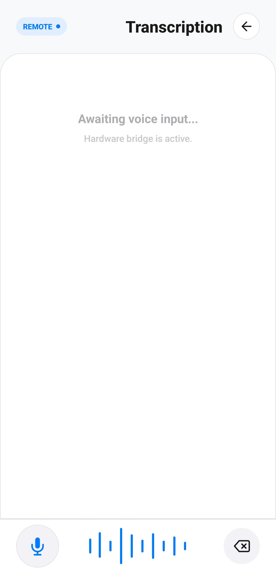

# EchoVision 🎙️

EchoVision is a powerful, privacy-focused React Native application that brings **local, on-device audio transcription** to your mobile device using OpenAI's Whisper model. It also supports **Cloud Processing** via WebSockets for extended capabilities.

Built with **Expo** and **whisper.rn**, this app performs inference directly on your phone or bridges it to a server. Your audio, your choice.

## 📸 Screenshots

| Home | Settings | Transcription |
|:---:|:---:|:---:|
|  |  |  |

## ✨ Key Features

- **On-Device Transcription:** No internet connection required. Fast, accurate, and private (via `whisper.rn`).
- **Cloud Bridge Processing:** Connect to a custom cloud API or local server via WebSockets for remote transcription.
- **Bluetooth Real-time Streaming:** Stream transcriptions live to your Linux system or Smart Glasses via Bluetooth Low Energy (BLE).
- **Offline Model Management:** Download, pause, resume, and delete Whisper models directly within the app (Tiny, Base, Small, English/Multilingual).
- **Arabic Script Support:** Full support for Arabic transcription.
- **Remote Controls:** Control font size and screen brightness for connected BLE devices (Smart Glasses) directly from the mobile app.
- **Modern UI:** A beautiful "Glassmorphism" design using `expo-blur` and linear gradients.
- **Hands-Free Mode:** Integrated silence detection and auto-start for seamless recording.
- **Background Downloads:** Model downloads continue with notifications even when minimized.

## 🛠️ Tech Stack & Architecture

### Mobile App (React Native / Expo)
- **Framework:** [Expo](https://expo.dev/) (SDK 54) / React Native
- **Transcription Engine:** [whisper.rn](https://github.com/mrousavy/whisper.rn) for local inference.
- **Audio Processing:** `expo-audio`, `react-native-live-audio-stream` for capturing raw audio chunks.
- **Bluetooth:** `react-native-ble-plx` to send transcription text and commands (brightness, font size) to external hardware.
- **State Management:** React Context (`BluetoothContext`, `DownloadContext`) and `AsyncStorage` for persistence.
- **Networking:** WebSockets for remote cloud transcription.

### Linux Receiver (If using BLE)
- EchoVision can connect to a Python-based BLE receiver (e.g., using `bless`, `Tkinter`, `blessed` for Terminal or GUI on smart glasses).

## 🚀 Getting Started

### Prerequisites

- [Node.js](https://nodejs.org/) (LTS recommended)
- [Bun](https://bun.sh/) (Recommended)
- Android/iOS device for testing (Bluetooth functionality requires a physical device)

### Installation

1.  **Clone the repository:**
    ```bash
    git clone https://github.com/your-username/echovision.git
    cd echovision
    ```

2.  **Install dependencies:**
    ```bash
    bun install
    ```

3.  **Run the app:**
    ```bash
    npx expo run:android # or run:ios
    ```

## 📖 Usage Guide

### 1. Local Transcription
1. Go to **Settings**.
2. Select your desired model family (Tiny, Base, Small) and language.
3. Tap **Start Download**. The app will fetch the `ggml` model from HuggingFace.
4. Once downloaded, return to **Home**, ensure "Cloud Processing" is OFF, and tap **Start Transcription**.

### 2. Cloud Processing
1. On the **Home** screen, toggle **Cloud Processing** ON.
2. Select **Cloud API** or **Local IP**.
3. Enter your WebSocket API Endpoint (e.g., `https://your-api.ngrok-free.dev` which auto-converts to `wss://`) or Local Server IP (`192.168.1.100:3000`).
4. Tap **Check** to verify the connection.
5. Tap **Start Transcription**. Audio chunks will be streamed to the server via WebSockets.

### 3. Bluetooth Streaming to Glasses
1. On the **Home** screen, tap **Search** to scan for BLE devices.
2. Select your receiver device (e.g., Smart Glasses or Linux Receiver) to connect.
3. Once connected, transcriptions will be automatically streamed to the device.
4. Go to **Settings** to adjust the **Brightness** and **Font Size** of the connected device's display.

## ⚙️ Model Configuration

- **Tiny / Base:** Recommended for fastest response on mobile devices.
- **Small:** Better accuracy but requires more RAM and processing power.
- **Multilingual:** Required for non-English languages (e.g., Arabic).

## 📄 License

This project is open-source and available under the [MIT License](LICENSE).
